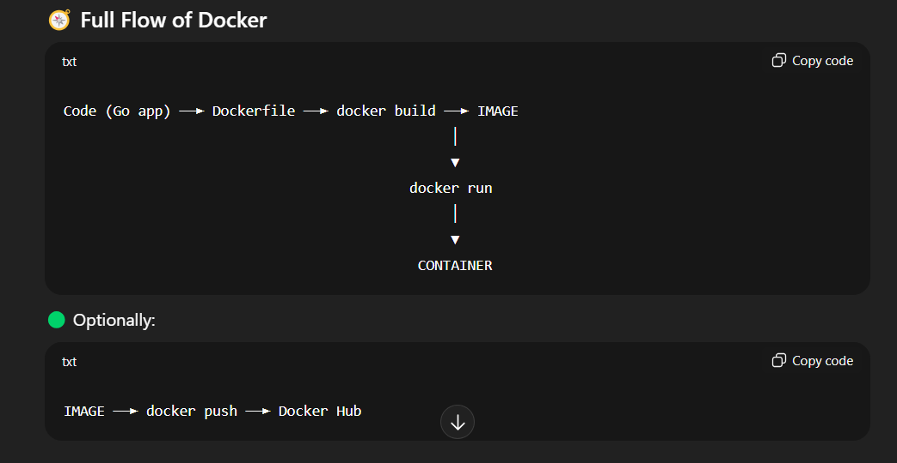

**go.mod file** tells Go which packages the project will use. its like a package.json file. it lists dependencies and their version
**go.sum file** is automatically generated whenever you add go packages using go get. It provides security guarantees that the dependencies haven’t been modified
**go mod tidy** If you ever want to clean up unused deps

**LIBRARY MANAGEMENT SYSTEM GUIDE**

# Entities

User -> id, name, email, password, role (admin or normal user)
Books -> id, title, author, stock
Borrows -> id, user_id (who borrowed -> fk to users), book_id (which book was borrowed -> fk to books), borrow_date, return_date (can be null if not yet returned)

# Admin

- manages books, monitors users, and updates stock

# Normal user

- Registers, logs in, borrows and returns books.

# High level flow

- Users sign up and log in -> uses JWT token for auth
- Admin can add, update, delete books.
- User can borrow available books, if stock is > 0.
- when borrowing, stock decreases by 1 vice versa when you return a book.
- System keeps history of who borrowed what and when.

**Relationships Btn Entities**

1. User to Borrow

# 1 to Many

- one user can borrow many books over time.
- Each borrow record belongs to only one user.

2. Book to Borrow

# 1 to many

- One book can appear in many borrow records (different users borrowing at different times)
- Each borrow record belongs to one book.

3. User to Book (many to many) (indirectly via borrow)

- user can borrow many books
- A book can be borrowed by many users.
- This r/shp will be modeled by borrows table.

**ERD REPRESENTATION**

**Difference Between log.default().Println() and fmt.Println()**

# fmt

- fmt belongs to the **fmt** package.
- it prints text to the console.
- has no timestamps, no logs, just raw text.
- example --> Connected to database

# log.default()

- Belongs to the log package
- log.Default returns the default logger instance in GO.
- it includes timestamps and supports logging with more structured info.
- example --> 2025/08/21 10:30:00 Connected to database

# e.Logger.Fatal

- this is Echo's logger instance.
- More advanced than Go's standard log, because it supports structured logging
- .Fatal logs the message at Fatal level, and after logging it terminates the program.
- outcome is sth like this::-> {"time":"2025-08-21T10:55:02Z","level":"FATAL","msg":"Error loading .env file","error":"open .env: no such file or directory"}

**fmt.Sprintf**

- formats a string and returns it

# Running a Go project

- go run main.go

# Difference btn **appAddress := fmt.Sprintf("localhost:%s", port)** and **appAddress :=fmt.Sprintf(":%s", port)**

- The first one explicitly binds the server to localhost only.
- The server is only accessible at htt://localhost:8080, but not via other n/w interfaces like LAN IP 127.0.0.1 or 0.0.0.0

- The second one is a shorthand for all available interfaces (like 0.0.0.0:8080) for IPV4 and [::]:8080 for IPV6
- The server is reachable not only at localhost:8080, but also from other devices on your n/w if firewall allows.

- In go fields must start with an uppercase letter to be exported (visible to GORM and JSON)

# INDEXING

- without and index, DB would do a full table scan.
- starts at row 1 and checks every email until it finds rwanjie.
- Thats O(n) time to check upto 1m records.

**With an Index**

- The DB creates a B-Tree (balanced search tree)
- In this tree - each node contains a range of sorted email values. Branch 1 contains emails from A TO D, Branch 2 contains emails from E TO H like that...
- The branches let the DB jump directly to the right section.
  **Analogy**
- Think of it like a dictionary - if you're looking for Rwanjie, you don't start from "Aaron"
  **A B-Tree works like looking for a word in a dictionary**

# Maps

- A map in go is just a key-value store
  **map[KeyType]ValueType**
- map[string]string -> keys are strings, values are strings
  **Example**
  return c.Json(http.statusBadRequest, map[string]string{
  "error":"Invalid request"
  })
- key is string, value is string

# Installing Redis

**go get github.com/redis/go-redis/v9**

- Data in redis is tored in key value pairs

# Installing Swagger for documentation

**go install github.com/swaggo/swag/cmd/swag@latest**

- the above is installed only once per machine

**go get github.com/swaggo/echo-swagger@latest**
**go get github.com/swaggo/swag@latest**

- From your module root where go.mod lives, run:
  **swag init -g cmd/api/main.go**
- -g points to the entry file containing the top-level annotations (main.go)
- This generates a docs/ package
- Everytime you change annotations or models, **swag init** again
  **swag init --generalInfo cmd/api/main.go --output docs**

# CI/CD Workflow

**Continuous Integration**

- Automating the process of testing and integrating code into a shared repo.
- Everytime you push to Github, a CI pipeline can:

1. Run unit tests
2. Check fromatting/linting
3. Build your Go project
4. Alter you if sth breaks

**The goal is to catch bugs early, ensure every commit is production ready**

# Continuous Deliver/Deployment

- This is about automating what happens after CI passes.

1. Deploy to a testing/staging server
2. Trigger an automated deployment to prod.
3. Build and push a docker image
4. Notify slack or discord
5. Tag releases

**Move from a working commit, to a delivered product with manual effort**

# Github Actions

- Github Actions is Github's native CI/CD tool. It uses workflows (writen in YAML) to define automated jobs that trigger events like:

1. push. 2. pull requests 3. release 4. manual dispatch

- workflows are defined in
  **.github/workflows/name.yml**

# Workflows

- A workflow is a YAML file, that contains one or more jobs.
- Each job contains steps(run commands, actions, scripts)
- All triggered by a specific event. (on:)

- workflow is like a recipe for Github actions

1. it defines when it run/triggers
2. What env to use (eg. ubuntu-latest)
3. What steps to take (eg. checkout code, build, test)

- Everything from CI to CD is in this file.

# Example

---

on: [push]

jobs:
build:
runs-on: ubuntu-latest
steps: - uses: actions/checkout@v3 - name: Set up Go
uses: actions/setup-go@v4
with:
go-version: '1.21' - name: Run Tests
run: go test ./...

---

# Example (in the .yml file for reference)

- **on** Triggers the workflow when you push to main or dev or even when you open a PR targeting main or dev.
- **jobs** Defines the job called **build-test** to run on an Ubuntu runner.
- **steps**

- name - workflow name
- inside the jobs there is also a name, thats the jobs name

1. **actions/checkout** - Gets your repo code.
2. **setup-go** - Installs Go in the runner
3. **go mod tidy** - cleans up go.mod and go.sum
4. **go-build** - checks for compilation issues.
5. **go-test** - runs your unit/integration tests.
6. **go-vet** - finds suspicious code.
7. **gofmt** - Ensures all Go files are properly formatted.

- If go test or go build fails, the workflow will stop and mark the build as failed.

**gofmt**

- Go's built in formatter -- its the Prettier of Go.
  **gofmt -l .**
- shows unformatted files
  **gofmt -w .**
- Auto formats everything
- -w: write the formatted output back to the files.
- . format the current directory recursively.

# Docker and Deploying Image to hub via pipeline

**Docker**

- is used for packaging your application into a portable container
- the container can then run on any machine be it local, cloud.

**Docker images**

- more of a recipe/blueprint.
- contains a **read-only** bundle of everything your app needs to run. (binaries, envs, code)

**Docker container**

- running instance of an image.
- its like launching a VM from a snapshot - its isolated, run fast, and can be created/destroyed instantly.
- this is a live, executable version of the image.

**Docker Hub**

- app store for docker images
- a registry where you push and pull images, like github but for containers.

**Dockerfile**

- set of instructions that tells docker how to build an image for your application.

- Docker desktop is a program on your local machine that lets you build, run and manage containers.
- Docker hub is a cloud registry like Github for images, where you store, share or pull container images.

**Build an image, then run it to get a container**

# Docker Flow

- **Code -> Docker file -> docker build -> Image -> docker run -> container**
  

- **image-> docker push -> docker hub**

# Building a docker file

**docker build -t lms-api .**

- -t is the tag name of the image
- . is the current directory, find the docker file in this current directory.

**docker images**

- view built image

**docker run -p 8080:8080 lms-api**

- run the container

**docker push lms-api**

- pushes this image to docker hub

**Loading .env into the image**

- docker run -p 8080:8080 --env-file .env lms-api
- docker run --env-file .env -p 8080:80 lms-api

**Option 2 of loading env**

- COPY .env .env

**host.docker.internal**

- injected into the .env where you defined services that run locally, helps docker communicate with local services outside the container environment.

**Docker compose**

- tool that lets you define and manage multi-container docker apps in a single YAML file

**Dockerfile describes how to build a **single** container(image + dependencies) while docker compose decribes how to run one or more containers together, and with settings like:: port mappings, volumes, envs, dependencies(DBs, redis, etc)**

- docker compose shines when you want to run multiple containers at one go, docker file only runs one at a time.

- docker compose allows you to:

1. define all your containers in one file.
2. run everything with one command.
3. rebuild easily with flags.
4. share dev environments with others using a single file.

- the run command is **docker compose up --build**
- cleaning up any existing containers **docker compose down**
- check if containers are running **docker compose ps**
- "3307:3306"
- 3307 is the host port, and 3306 is the container port

# Start your development environment

- the command below starts every service
  docker compose up --build

# Run in background

docker compose up -d --build

# Check logs

docker compose logs -f app

# Stop everything

- stops and removes the containers, networks, you'll need to run docker compose up again to restart
  docker compose down

**stop a single service**

- docker compose stop app
- to restart it
- docker compose start app

# Restart just your app after code changes

docker compose restart app

# Or rebuild and restart

- this commands starts only the app service, redis and MYSQL won't restart unless they're dependencies of app.
- docker compose up --build app

**starting docker**

- sudo systemctl start docker

**stopping docker**

- sudo systemctl stop docker

**Restart docker**

- sudo systemctl restart docker

**enable docker on boot(auto start)**

- sudo systemctl enable docker

**disable docker from starting on boot**

- sudo systemctl disable docker

**check docker status**

- sudo systemctl status docker

  **verify its running**

- docker ps

**Access MySql and Redis**

- mysql -h 127.0.0.1 -P 3307 -u root -p
- docker exec -it {{container-name}} mysql -u root -p

- redis-cli -h 127.0.0.1 -p 6380
- docker exec -it redis-1 redis-cli

# FULL DOCKER FLOW COMMANDS

1. start fresh (build everything, every service)

- docker compose up --build -d
- -- build forces rebuilding images if needed.
- -d - detached mode (runs in background)

2. Check containers

- docker ps
- docker compose ps

3. Rebuild only the app (when you change your Go code)

- docker compose up - restart all containers if you did not touch the dockerfile or GO source code
- docker compose up --build -d app

4. Restart a single service (no rebuild)

- docker compose restart app
- docker compose stop app
- dcoker compose start app

5. Stop services

- docker compose stop app

- stop everything in your stack
- docker compose down

6. Logs(debugging)

- view all logs
- docker compose logs -f

- logs for only the app
- docker compose logs -f app

7. remove everything

- if you want totally clean environment
- docker compose down -v

- docker compose run --rm app go run ./internal/database/migrate.go

- quit; - exit from mysql terminal

# Redis commands

**List all keys**

- KEYS \*
- SCAN 0

**Get key value**

- GET user:1
- HGETALL user:1

**DELETE a key**

- DEL user:1

# Pushing image to docker hub

**docker build -f dockerfile -t ryanwanjie266/lms:latest .**

- -f dockerfile tells Docker to use your file named dockerfile (not Dockerfile).

- -t ryanwanjie266/lms:latest tags the image with your Docker Hub repo and the latest tag.

**Login to docker hub via cli**

- docker login
- enter hub username - ryanwanjie266
- enter pwd or access token

**push the image to hub**

- docker push ryanwanjie266/lms:latest

**Why push images to docker hub**

1. Portability & collaboration.

- anyone can pull and run your app instantly, with zero code sharing

2. Consistency

- Every environamtn runs the exact same container

3. CI/CD Automation

- CI/CD can push a new image every time you merge to main/master.
- Your servers cam auto pull the latest, making rolling out updates easy.

4. Deployment

- Popular platforms can pull and deploy from hub, so you don't have to upload huge images every time.

# PRELOAD

- Preload("user") tells GORM, when you select from db, also run a join or separate query to fetch the associated User, and populate the user field on the book struct.
- It **ONLY** affects **SELECT (read) queries**.

# Rate Limiting

- Restricting the number of requests a user can make in a given time window.
- Two main ways in go

1. Use a third party middleware
2. Roll your own using redis.

**go get github.com/labstack/echo-contrib/middleware**
